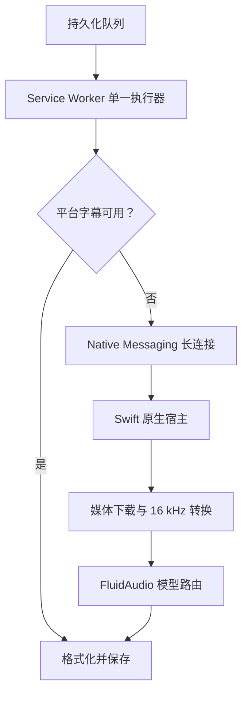

# SparkSub 后台整视频本地转录设计

## 1. 目标

当用户把 Bilibili 或 YouTube 视频加入队列后，即使没有打开或播放视频，SparkSub 也必须在后台完成以下闭环：

1. 解析视频元数据；
2. 优先获取平台原生字幕；
3. 原生字幕不可用时获取完整音频；
4. 调用本机 CoreML 模型转录整条音频；
5. 持久化带时间戳的字幕并生成 TXT、SRT 和 Markdown；
6. 在侧边栏持续展示真实阶段、进度、错误和使用的字幕来源。

“获取到音频直链”不得再被视为任务完成。只有取得非空字幕正文并完成格式化后，任务才能进入 `done`。

## 2. 已确认的现状

### 2.1 可复用部分

- 队列已有持久化、并发认领、阶段恢复和结果导出框架。
- Bilibili 已能解析视频元数据、字幕列表和 DASH 音频流。
- YouTube 已有多策略字幕获取，包括活跃页面桥接、Innertube 和 Watch HTML。
- `QueueStage` 已预留 `fetching_audio` 与 `transcribing`。
- 字幕解析和导出格式已经统一为 `{ from, to, content }` cue。

### 2.2 必须修复的结构问题

- Bilibili 无字幕时目前只保存音频 URL，然后以零条字幕标记 `done`。
- YouTube 无字幕时直接失败，项目内没有可供无人值守队列使用的音频提取器。
- 现有媒体下载通道面向用户下载目录，或把整个文件 Base64 回传扩展，不适合长视频 ASR。
- Service Worker、Offscreen Document 和侧边栏都可能调用 `processPendingJobs()`；租约只能减少重复执行，不能替代单一调度权。
- 当前没有 Native Messaging 客户端，也没有真正的 ASR Worker。
- 五分钟固定租约不能覆盖长视频下载、CoreML 冷启动和整条转录。

## 3. 产品行为

### 3.1 字幕来源优先级

每个任务严格按以下顺序处理：

1. 平台人工字幕；
2. 平台自动 CC/ASR 字幕；
3. 可用的目标语言翻译轨；
4. 本地音频转录。

平台字幕成功时不得下载媒体或启动本地模型。字幕轨列表为空、所有字幕正文均为空，或字幕正文经过全部安全重试仍不可用时，才进入本地转录。

### 3.2 语言与模型路由

队列任务保存 `sourceLanguage`：

- `auto`：使用平台语言提示；Bilibili 没有提示时默认普通话，YouTube 没有提示时默认 Parakeet 自动识别；
- `zh`：使用 Cohere Mandarin 适配器；
- `yue`：只允许平台原生字幕，不启动本地 ASR；
- `en` 或欧洲语言代码：使用 Parakeet TDT v3；
- 其他语言：返回明确的 `ASR_LANGUAGE_UNSUPPORTED`。

粤语任务没有可用的 YouTube 原生字幕时必须失败，并提示“本机模型不支持粤语”；不得让普通话或欧洲语言模型产生伪字幕。

### 3.3 任务状态

本地回退的正常阶段为：

`queued → resolving → fetching_caption → fetching_audio → transcribing → postprocessing → done`

建议进度区间：

- 元数据解析：0–20%；
- 字幕探测：20–50%；
- 音频解析与下载：50–70%；
- 音频转换与 ASR：70–95%；
- 格式化与持久化：95–100%。

原生宿主每次进度事件都续期队列租约。写入存储应按百分比变化或时间间隔节流，避免高频写放大。

## 4. 总体架构

### 4.1 扩展端职责

- Service Worker 是唯一队列执行器。
- 侧边栏、推荐流按钮和 Offscreen Document 只负责入队、展示或发出唤醒消息，不直接执行任务。
- 扩展端解析平台字幕和 Bilibili DASH 描述符。
- 扩展端只向宿主发送 URL、受限请求头、语言和任务标识，不传输完整媒体字节。
- 扩展端组装宿主分块回传的 cues，并沿用现有格式化器生成结果。

### 4.2 原生宿主职责

- 通过 Chrome Native Messaging 的 32 位长度前缀 JSON 协议通信。
- 下载媒体到 SparkSub 管理的临时目录，任务结束、取消或失败后清理。
- YouTube 使用锁定版本的官方 `yt-dlp_macos` 独立二进制；以 `Process` 参数数组调用，禁止经过 shell。
- Bilibili 使用扩展解析出的 DASH URL、备用 URL 和受限请求头直接下载。
- 通过 FluidAudio 加载已有 CoreML 模型，执行整条音频的本地转录。
- 按小于 Native Messaging 1 MiB 上限的消息分块回传字幕。
- 所有日志写入 stderr；stdout 只写协议帧。

### 4.3 Service Worker 生命周期

本地 ASR 期间使用 `chrome.runtime.connectNative()` 保持长连接。活动 Native Messaging 连接会维持扩展 Service Worker；端口意外断开时，当前任务进入可重试失败，租约到期后可恢复。

Offscreen Document 不再承担队列执行。其文件暂时保留，避免扩大到无关删除；后续可在独立清理任务中移除。

## 5. Native Messaging 协议

宿主名固定为 `com.sparksub.transcriber`，协议版本为 `1`。

### 5.1 请求

- `capabilities`：返回宿主、下载器和模型可用性；
- `transcribe`：开始整视频转录；
- `cancel`：按 `jobId` 取消；
- `ping`：诊断连接。

所有请求包含 `requestId` 和 `protocolVersion`。`transcribe` 包含：

- `jobId`；
- `sourceLanguage`；
- `source`：`youtube` 或 `remote`；
- YouTube 规范 URL，或远程音频 URL、备用 URL 和允许的请求头；
- 可选标题、时长和平台语言提示。

### 5.2 响应与事件

- `response`：普通请求成功或失败；
- `progress`：阶段、百分比和用户可读提示；
- `resultBegin`：结果元数据；
- `resultChunk`：有序 cues 分块；
- `resultEnd`：完整性校验与结束；
- `error`：稳定错误码、可重试性和提示。

客户端必须验证 `requestId`、`jobId`、分块序号和总分块数。缺块、重复结束或超过合理结果上限都视为协议错误。

## 6. 媒体获取

### 6.1 Bilibili

把现有 DASH 选择逻辑提取成可复用的纯函数，统一：

- `baseUrl/base_url`；
- `backupUrl/backup_url`；
- 按码率选择最佳音频；
- `Referer` 与 `User-Agent`；
- 允许的 Bilibili CDN 域名和 HTTPS 校验。

队列不持久化可过期签名 URL。任务恢复时重新解析音频描述符，并立即交给宿主下载。

### 6.2 YouTube

扩展只发送 `https://www.youtube.com/watch?v=<videoId>`。宿主使用：

- 固定版本 `yt-dlp_macos`；
- `--no-config`，避免用户全局配置改变行为；
- `--no-playlist`，保证单视频边界；
- `bestaudio/best`；
- 任务专属输出目录；
- 结构化进度模板。

安装脚本下载固定 release 的二进制和官方 SHA256 清单，校验成功后才替换现有文件。下载器不存在或校验失败时，能力检查和队列错误必须清楚区分。

## 7. 模型适配

### 7.1 Parakeet TDT v3

默认查找：

`~/Library/Application Support/parakeet-tdt-0.6b-v3`

需要：

- `Preprocessor.mlmodelc`；
- `Encoder.mlmodelc`；
- `Decoder.mlmodelc`；
- `JointDecisionv3.mlmodelc`；
- `parakeet_vocab.json`，或兼容别名 `parakeet_v3_vocab.json`。

宿主在自己的 Application Support 兼容目录创建符号链接，不修改用户原模型目录。使用 `AsrModels.load(... version: .v3)` 和完整文件批量转录 API。根据 token timings 聚合 2–8 秒、句意完整的 cues。

### 7.2 Cohere Transcribe

默认查找用户给出的 FluidAudio/Cohere 缓存目录。当前公开 FluidAudio 需要 cache-external decoder 和 `vocab.json`，而已有缓存文件名不完全一致，因此适配器必须：

1. 搜索标准文件名和已知带时间戳别名；
2. 加载前检查 CoreML 输入描述；
3. 只在 decoder 暴露 `k_cache_0` 时启用；
4. 找不到词表或结构不兼容时报告 `MODEL_LAYOUT_INCOMPATIBLE`，不得只改名后盲目运行。

普通话音频按接近 30 秒、低能量边界切分成无重叠窗口，每个窗口产生一条或多条有真实时间范围的 cue。模型在宿主进程内复用，避免每段重复冷启动。

## 8. 安全与资源边界

- Native host manifest 只允许安装脚本传入的一个扩展 ID，不使用通配符。
- YouTube URL 只接受官方主机和 11 位视频 ID。
- 远程媒体 URL 只接受 HTTPS 和 Bilibili 允许域名。
- 宿主忽略任意文件输出路径；所有路径由宿主在自己的临时根下生成。
- 不读取或导出浏览器 Cookie。本版本只保证公开可访问视频；登录、会员或年龄限制内容返回 `MEDIA_AUTH_REQUIRED`。
- 单条宿主消息保持在 900 KiB 以下；完整字幕设置合理 cue 数量与字节上限。
- 取消任务必须终止 `yt-dlp` 子进程和模型后续工作，并清理临时目录。

## 9. 错误模型

稳定错误码至少包括：

- `NATIVE_HOST_NOT_INSTALLED`；
- `NATIVE_HOST_DISCONNECTED`；
- `PROTOCOL_MISMATCH`；
- `YTDLP_NOT_INSTALLED`；
- `YTDLP_CHECKSUM_FAILED`；
- `MEDIA_AUTH_REQUIRED`；
- `MEDIA_DOWNLOAD_FAILED`；
- `MODEL_NOT_FOUND`；
- `MODEL_LAYOUT_INCOMPATIBLE`；
- `ASR_LANGUAGE_UNSUPPORTED`；
- `ASR_FAILED`；
- `RESULT_INCOMPLETE`；
- `CANCELLED`。

队列持久化 `errorCode`、`error`、`errorHint` 和 `retriable`。重试清理旧阶段产物，但保留用户语言选择。

## 10. 侧边栏交互

队列批量输入区增加来源语言选择：自动、普通话、粤语、英语/欧洲语言。队列顶部显示原生宿主能力状态：

- 已就绪：展示可用模型；
- 部分就绪：说明缺少哪个模型或下载器；
- 未安装：给出安装命令入口和诊断提示。

完成卡片展示来源：人工字幕、自动 CC、翻译字幕、Parakeet 或 Cohere。失败卡片显示稳定错误提示；技术细节保留在可复制诊断信息中。

## 11. 测试与验收

### 11.1 JavaScript 自动化测试

- Bilibili 无字幕时必须调用原生宿主并保存非空 cues，不能以音频直链标记完成；
- YouTube 无标签页、无字幕轨时仍进入原生宿主；
- 粤语无字幕时不调用 ASR，并返回语言不支持；
- Native Messaging 分块乱序、缺块、断开和取消行为；
- 进度事件续租且存储写入受到节流；
- 只有 Service Worker 启动队列执行；
- 原有平台字幕路径保持通过。

### 11.2 Swift 测试

- Native Messaging 帧编码/解码和消息大小边界；
- URL 与请求头白名单；
- yt-dlp 参数不经过 shell 且输出限制在任务目录；
- 模型别名解析和 Cohere `k_cache_0` 能力检查；
- token timing 与普通话窗口结果转 cue；
- 取消和临时文件清理。

### 11.3 验收场景

1. 有官方字幕的 YouTube 视频：不下载音频，结果来源正确；
2. 无官方字幕的欧洲语言 YouTube 视频：关闭视频页后仍由 Parakeet 完成；
3. 无字幕普通话 Bilibili 视频：由 Cohere 完成；
4. 无字幕粤语 YouTube 视频：明确失败且不生成伪字幕；
5. Chrome 或宿主中途退出：任务可恢复，不产生两个完成结果；
6. 一小时视频：结果分块回传，不超过 Native Messaging 单消息上限。

## 12. 非目标

- 不实现粤语离线 ASR；
- 不读取 Chrome Cookie 或处理付费/私密媒体；
- 不加入 SwiftUI 悬浮字幕窗；
- 不把 Gemma 后处理加入本次关键路径；
- 不在扩展进程中保存完整音频；
- 不承诺在 Linux 环境编译 CoreML 宿主，macOS 构建由专用 CI 或用户机器完成。
